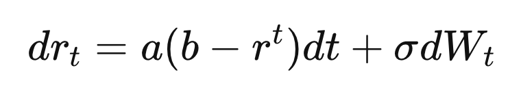
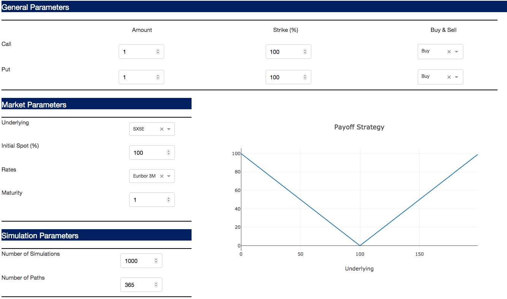
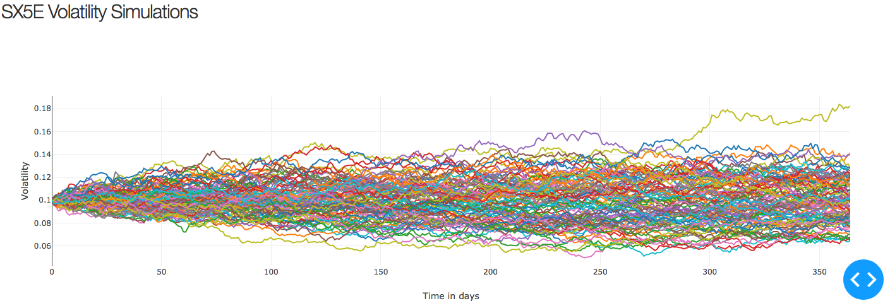
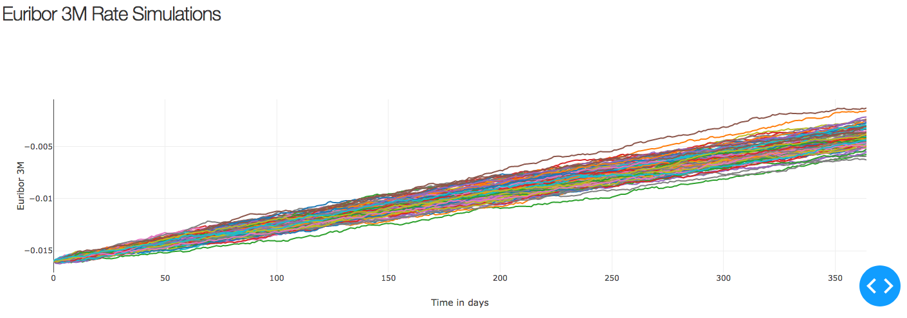
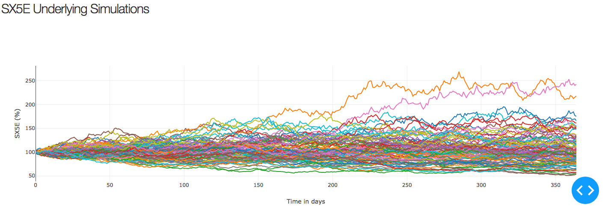

# Heston &amp; Vasicek Model | Call &amp; Put Linear Payoffs

<!-- PROJECT Presentation -->

  <h3 align="center">Python Project | Master 203 | 2020</h3>
  
   <br />
<p align="center">
  <a href="https://github.com/antoineletacon/project">
    
  </a>

  <h3 align="center">Heston & Vasicek Model | Option Pricing</h3>
  <p align="center">
    <br />Antoine Le Tacon | Léa Pinto | Florian Schirrer
  </p>
</p>

<!-- TABLE OF CONTENTS -->
## Table of Contents

* [About the Project](#about-the-project)
  * [Built With](#built-with)
* [Getting Started](#getting-started)
  * [Prerequisites](#prerequisites)
  * [Installation](#installation)
* [Heston and Vasicek Model](#heston-and-vasicek-model)
  * [Heston Model](#heston-model)
  * [Vasicek Model](#vasicek-model)
* [Usage](#usage)
  * [Fill the form](#vasicek-model)
  * [Fixed Parameters](#fixed-parameters)
* [Simulations](#Simulations)
  * [Heston Model Graphic ](#heston-model-graphic)
  * [Vasicek Model Graphic ](#vasicek-model-graphic)
  * [Underlying Graphic ](#underlying-graphic)
* [Contact](#contact)

<!-- ABOUT THE PROJECT -->
## About The Project

### Built With

* []()Python 3.7
* []()Dash 1.7.0

<!-- GETTING STARTED -->
## Getting Started

To get a local copy up and running follow these simple steps.

### Prerequisites

* Dash Installation - in your terminal, install several dash libraries

```sh
pip install dash==1.7.0
```

### Installation
 
* Python & Dash Code - on Spyder, run the code and copy-paste on Firefox the relevant adress 

```sh
http://127.0.0.1:8050/
```

<!-- USAGE EXAMPLES -->
## Heston and Vasicek Model

### Heston Model 

The model considers the following dynamic of the stock price:

<br />
<p align="center">
  <a href="https://github.com/antoineletacon/project">
    
  </a>

and the following mean-reverting process for the volatility:

<br />
<p align="center">
  <a href="https://github.com/antoineletacon/project">
    
  </a>

where the two Brownian motions are correlated,

<br />
<p align="center">
  <a href="https://github.com/antoineletacon/project">
    
  </a>

### Vasicek Model 

The model specifies that the instantaneous interest rate follows the stochastic differential equation:

<br />
<p align="center">
  <a href="https://github.com/antoineletacon/project">
    
  </a>

where:
* W is a random market risk (represented by a Wiener process),
* t is the time period,
* a(b−r^t) is the expected change in the interest rate at time t (the drift factor),
* a is the speed of the reversion to the mean,
* b is the long-term level of the mean,
* σ is the volatility at time t, 

## Usage

### Fill the form

The option pricer computes Call & Put Linear Payoffs. For illustration purposes only, the default strategy is a Straddle. 

* In the General Parameters tab, fill the following parameters : Amount of Call / Put | Strike (%) | Buy & Sell. 
* In the Market Parameters tab, fill the following parameters : Underlying | Initial Spot (%) | Rates | Maturity. 
* In the Simulation Parameters tab, fill the following parameters : Number of Simulations | Number of Paths. 

The payoff representation of the strategy is automatically updated. 
The price of the strategy is displayed by clicking on the price button. A Monte-Carlo approach is used to price the different strategies. The different trajectories are then drawn. 

In case you want to price another strategy, please refresh the page. 

  <br />
<p align="center">
  <a href="https://github.com/antoineletacon/project">
    
  </a>

### Fixed Parameters

* The initial volatility used in the Heston Model (as a starting point) differs according to the underlying. 

```sh
For SX5E : Current Volatility (Starting Point) = 0.1
For SPX : Current Volatility (Starting Point) = 0.15
For NIKKEI : Current Volatility (Starting Point) = 0.14
```

* The parameters used in the Vasicek Model differs according to the rate. Only the speed of the reversion to the mean is fixed (0.2). 
```sh
For EURIBOR 3M : Current Annualized Rate (Starting Point) = -0.004*4 
For EURIBOR 3M : Rate Volatility = 0.0125
For EURIBOR 3M : Long-term level of the mean = -0.03

For LIBOR 3M USD : Current Annualized Rate (Starting Point) = 0.019*4
For LIBOR 3M USD : Rate Volatility = 0.014
For LIBOR 3M USD : Long-term level of the mean = 0.02
```

* For simplification and design purposes, the Heston Model parameters rho, kappa, theta, lambda and sigma are fixed. 
```sh
rho = 0.6 | kappa = 1 | theta = 0.1 | lambda = 0 | sigma = 0.1
```

## Simulations

### Heston Model Graphic 

<br />
<p align="center">
  <a href="https://github.com/antoineletacon/project">
    
  </a>
  
### Vasicek Model Graphic 

  <br />
<p align="center">
  <a href="https://github.com/antoineletacon/project">
    
  </a>

### Underlying Graphic 

  <br />
<p align="center">
  <a href="https://github.com/antoineletacon/project">
    
  </a>

<!-- CONTACT -->
## Contact 

* Antoine Le Tacon | antoine.le-tacon@dauphine.eu
* Léa Pinto | lea.pinto@dauphine.eu
* Florian Schirrer | florian.schirrer@dauphine.eu

Project Link: [https://github.com/antoineletacon/project](https://github.com/antoineletacon/project)
